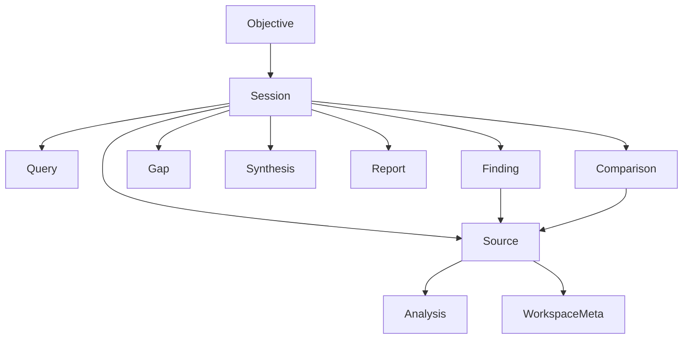
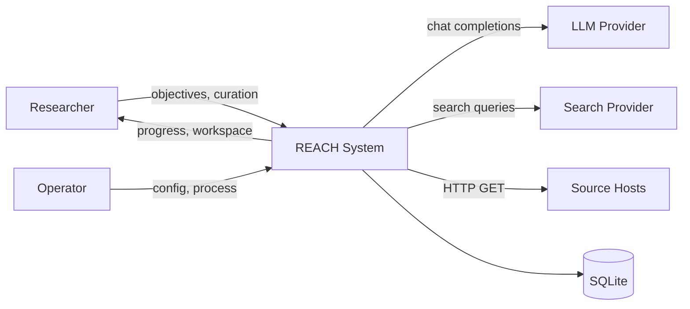

# REACH — Conceptual Requirements Model (CRM)

| Field | Value |
| --- | --- |
| Document ID | REACH-CRM-001 |
| Product | REACH — Research Exploration, Aggregation & Context Hub |
| Version | 0.1.0 |
| Status | Baseline (aligned to implemented system) |
| Normative companion | [SRS.md](SRS.md) |
| Product companion | [PRD.md](PRD.md) |

## 1. Purpose of this document

The Conceptual Requirements Model (CRM) defines **what REACH is for**,
**who interacts with it**, and **which conceptual objects and capabilities**
must exist — independent of a specific UI layout or provider brand.

The CRM is the bridge between stakeholder intent ([PRD.md](PRD.md)) and
testable software requirements ([SRS.md](SRS.md)). When CRM and SRS
conflict, reconcile them deliberately; do not silently diverge from the
implemented codebase without an explicit version bump.

## 2. Problem context

### 2.1 Current-state pain

Knowledge workers investigating a technical or academic objective must:

1. Invent search queries covering multiple research dimensions.
2. Triage dozens of heterogeneous results (papers, repos, docs, blogs).
3. Open and read sources manually.
4. Mentally synthesize agreements, disagreements, and unknowns.
5. Preserve links between claims and evidence.

Search engines optimize for ranked links. Chat tools optimize for fluent
answers. Neither reliably delivers a **bounded, provenance-backed research
workspace** organized around an objective.

### 2.2 Desired-state outcome

A user states an objective once. The system plans the investigation,
discovers and filters sources, analyzes them structurally, synthesizes
findings with evidence links, surfaces open questions, and produces a
research report — all inspectable in a workspace with paths back to
original URLs.

## 3. Vision statement

> REACH turns a research objective into the knowledge needed to understand
> it: planned queries, a strong source set, grounded analyses, cross-source
> findings, open questions, and a markdown briefing — bounded, traceable,
> and operable without heavyweight infrastructure.

## 4. Stakeholders

| Stakeholder | Interest | Success signal |
| --- | --- | --- |
| Primary researcher / builder | Fast, defensible survey of a build/study objective | Completes a run and cites linked sources in their next step |
| Student / analyst | Academic-leaning discovery + open questions | Sees papers prioritized; gaps are actionable |
| Product owner | Clear scope and non-goals | Demoable mock path; documented limits |
| Backend engineer | Stable contracts and testable agents | SRS + tests map 1:1 to behaviors |
| Frontend engineer | Predictable API + view models | Normalization layer remains thin |
| Operator / demo host | Keyless smoke + simple deploy | `launch.sh` / mock mode works |
| External provider (LLM/search) | Correct API usage within quotas | Bounded calls; failures degrade |

## 5. Actors

| Actor | Type | Description |
| --- | --- | --- |
| **Researcher** | Human | Submits objectives, reviews workspace, curates sources, compares, reads report |
| **System** | Software | REACH backend + web application |
| **LLM Provider** | External system | Structured generation for plan/analyze/synthesize/compare/report |
| **Search Provider** | External system | Web (and similar) result discovery per query |
| **Source Host** | External system | Origin of fetched page content |
| **Operator** | Human | Configures env, runs processes, manages DB files |

There is **no Authenticated User** actor in v0.1 — network reachability
implies ability to use the API.

## 6. Conceptual objects

| Concept | Definition | Persistence |
| --- | --- | --- |
| **Objective** | Natural-language research goal (8–1000 chars) | Stored on session |
| **Session** | One bounded research run + post-run artifacts | `research_sessions` |
| **Query** | Planned search string covering a research dimension | `queries` |
| **Source** | Discovered URL with type, score, fetch state, analysis | `sources` |
| **Analysis** | Structured per-source understanding | JSON on source |
| **Finding** | Cross-source claim with supporting source ids | `findings` + join |
| **Gap** | Open question with rationale | `research_gaps` |
| **Synthesis** | Concise research brief | JSON on session |
| **Report** | Intent-aware markdown document | JSON/markdown on session |
| **Comparison** | Pairwise relation between two sources | `source_comparisons` |
| **Workspace meta** | Star, save, note, tags | Columns on source |
| **Progress** | Status + percent + message | Columns on session |

## 7. Conceptual capabilities

### C1 — Objective intake

Accept a research objective, validate length/content, create a session,
return an identifier immediately.

### C2 — Investigation planning

Derive a small set of dimension-covering queries; ensure academic coverage
when missing; fall back deterministically if planning intelligence fails.

### C3 — Source discovery & selection

Search per query, normalize/dedupe, classify, rank with trusted-domain and
academic preference, select a bounded strong set (≈8–15).

### C4 — Source acquisition & analysis

Fetch bounded content; parse to text; produce structured analysis grounded
in available material; isolate per-source failures.

### C5 — Cross-source synthesis

Produce findings with provenance, open questions, and a brief overview of
projects/technologies.

### C6 — Research reporting

Detect intent (build / study / general); render a markdown report with
grounded appendices; fall back if generation fails.

### C7 — Progress observation

Expose pollable progress so clients can render stage-aware UX without
push protocols.

### C8 — Workspace curation

Allow starring, saving, tagging, noting sources; filter workspace lists.

### C9 — On-demand deepen

Compare two sources; regenerate a focused summary for one source.

### C10 — Session recall

List prior sessions with lightweight counts for re-entry.

### C11 — Hermetic operation

Run the full capability set without external keys for demo/CI (mock mode).

## 8. Conceptual use cases

### UC-01 Start research

| Item | Content |
| --- | --- |
| Actor | Researcher |
| Precondition | System available |
| Trigger | Submit objective |
| Main flow | Validate → create session → start async pipeline → return id → client polls |
| Alt | Invalid objective → reject; capacity full → reject with busy signal |
| Postcondition | Session exists in `planning` (or beyond) |

### UC-02 Monitor progress

| Item | Content |
| --- | --- |
| Actor | Researcher |
| Trigger | Open/await session |
| Main flow | Poll status until `complete` or `failed` |
| Postcondition | UI reflects latest progress message/percent |

### UC-03 Review workspace

| Item | Content |
| --- | --- |
| Actor | Researcher |
| Precondition | Session has artifacts (ideally `complete`) |
| Main flow | Load detail → inspect queries, sources, findings, gaps, summary, report |
| Postcondition | Researcher can navigate to original source URLs |

### UC-04 Curate source

| Item | Content |
| --- | --- |
| Actor | Researcher |
| Main flow | Star/save/tag/note a source → persisted on source row |
| Postcondition | Filters can retrieve curated subsets |

### UC-05 Compare sources

| Item | Content |
| --- | --- |
| Actor | Researcher |
| Precondition | ≥2 sources in session |
| Main flow | Select A/B → compare → view similarities/differences/contradictions |
| Postcondition | Comparison stored for session history |

### UC-06 Summarize source

| Item | Content |
| --- | --- |
| Actor | Researcher |
| Main flow | Request summarize → receive `Analysis` |
| Postcondition | Updated analysis available on source |

### UC-07 Browse history

| Item | Content |
| --- | --- |
| Actor | Researcher |
| Main flow | List sessions → open prior session by id |
| Postcondition | Detail rehydrated from storage |

### UC-08 Operate in mock mode

| Item | Content |
| --- | --- |
| Actor | Operator / CI |
| Main flow | Enable mock → exercise UC-01…UC-07 without provider keys |
| Postcondition | Deterministic artifacts sufficient for contract tests |

## 9. Business rules (conceptual)

| ID | Rule |
| --- | --- |
| BR-01 | Research is **bounded** — never unbounded crawl loops |
| BR-02 | **Deterministic preprocessing** precedes LLM spend where possible |
| BR-03 | LLM outputs that are persisted must be **schema-validated** |
| BR-04 | Findings must retain **supporting source references** when mappable |
| BR-05 | Open questions are **questions**, not silent omissions disguised as facts |
| BR-06 | A single source failure must **not** abort the whole session |
| BR-07 | Every LLM stage must have a **deterministic fallback** |
| BR-08 | Fetched content is **untrusted** and not executed/rendered as HTML |
| BR-09 | Mock mode must exercise the **same capability surface** as real mode |
| BR-10 | Secrets never belong in the repository |

## 10. Quality attributes (conceptual)

| Attribute | Conceptual expectation |
| --- | --- |
| Reliability | Partial success preferred over total failure |
| Traceability | Claims → sources → URLs |
| Operability | Single-process local run; Makefile/scripts |
| Observability | Persisted progress readable by clients |
| Maintainability | Provider abstractions; centralized prompts |
| Cost control | Hard caps on queries/sources/content |
| Safety | No auth in v0.1 ⇒ assume trusted network; document risk |

Detailed measurable NFRs live in [SRS.md](SRS.md) § Non-functional
requirements.

## 11. Domain glossary

| Term | Meaning |
| --- | --- |
| Objective | User’s research goal statement |
| Dimension | Facet of investigation (academic, tools, limitations, …) |
| Provenance | Link from a finding to supporting sources |
| Gap / open question | Unresolved question after synthesis |
| Workspace | UI + API surface for inspecting and curating a session |
| Trusted domain | Host preferential in ranking (academic/docs/code forges) |
| Mock mode | Keyless deterministic providers for demo/CI |
| Intent | Report template family: build / study / general |

## 12. Context diagram

## 13. Assumptions

1. The operator can install Python 3.11+ and Node 20+.
2. For real research, valid LLM and search credentials are available.
3. Outbound HTTPS is permitted from the REACH host.
4. A single logical user operates a given deployment in v0.1.
5. English objectives are the primary supported input.

## 14. Constraints

1. No mandatory cloud services beyond chosen LLM/search providers.
2. SQLite is the persistence engine for v0.1.
3. Research execution is in-process asyncio (no external worker mesh).
4. License: MIT (see repository `LICENSE`).

## 15. Traceability to SRS

| CRM capability | Primary SRS sections |
| --- | --- |
| C1 Objective intake | FR-API-01, FR-VAL-01 |
| C2 Planning | FR-AG-PLAN-* |
| C3 Discovery/selection | FR-AG-RES-* |
| C4 Fetch/analyze | FR-SRC-* |
| C5 Synthesis | FR-AG-SYN-* |
| C6 Reporting | FR-AG-REP-* |
| C7 Progress | FR-API-STATUS |
| C8 Curation | FR-API-WS-* |
| C9 Deepen | FR-API-CMP-*, FR-API-SUM |
| C10 History | FR-API-LIST |
| C11 Mock | FR-OPS-MOCK, NFR-TEST-* |

## 16. Revision history

| Version | Date | Notes |
| --- | --- | --- |
| 0.1.0 | 2026-09-20 | Initial CRM aligned to implemented REACH pipeline + workspace |
