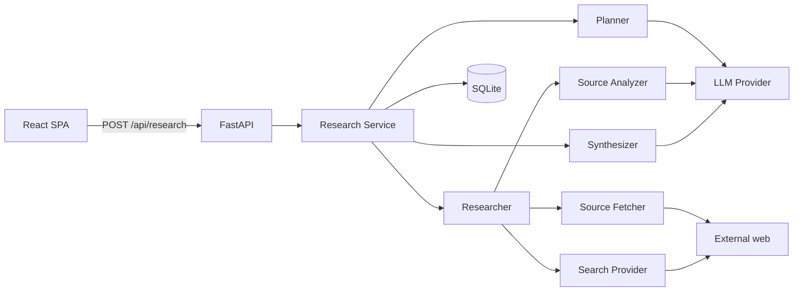

# REACH — Architecture

> Research Exploration, Aggregation & Context Hub

REACH turns a research objective into a focused research workspace. Search
engines return sources; REACH organizes the investigation around the
objective.

## System overview



## Layers (backend)

### API layer — `app/api/routes/research.py`

Three endpoints:

- `POST /api/research` — validate the objective, create a session row, and
  dispatch an in-process `asyncio` research task. Returns `session_id`.
- `GET /api/research/{id}/status` — poll persisted progress
  (`status`, `progress` 0–100, `message`).
- `GET /api/research/{id}` — assemble the full workspace payload
  (queries, sources, findings, gaps, summary).

No WebSockets: research progress is persisted to SQLite and the client
polls, which is trivial and robust for the prototype.

### Research service — `app/services/research_service.py`

The orchestrator. Owns the repositories and the in-flight task registry,
runs the deterministic pipeline, and persists each stage before moving on
so an interrupted run still shows partial state:

```
PLANNING → SEARCHING → FILTERING → FETCHING → ANALYZING → SYNTHESIZING → COMPLETE
```

Any uncaught failure marks the session `failed` with a human message; the
rest of a partially-completed session remains available.

### Research agent — `app/agent/`

- **Planner** (`planner.py`): one LLM structured call produces a `QueryPlan`
  (5–7 queries). Queries are deduplicated, bounded, and labelled with
  research dimensions (core concept, implementations, academic, technical,
  tools, benchmarks, limitations). A deterministic fallback keeps the run
  alive if the LLM fails.
- **Researcher** (`researcher.py`): discovery + selection + fetch + analyze
  orchestration. Searches are run concurrently per query; raw results are
  normalized and deduplicated; candidates are ranked by provider score,
  source-type quality, domain quality, and lexical overlap with the
  objective; the top 8–15 are selected. Fetches and analyses run under a
  bounded semaphore, and each item's failure is isolated.
- **Synthesizer** (`synthesizer.py`): aggregates the analyzed sources into
  a typed brief (`SynthesisResult`), maps each finding's supporting source
  titles back to source ids for provenance, and produces open questions and
  the research summary. A fallback view keeps sessions complete if the
  model call fails.

### Search layer — `app/search/`

- `base.py` — `SearchProvider` interface (`search(query, limit) → SearchResult`).
- `provider.py` — `TavilySearchProvider` (default) and `MockSearchProvider`
  (keyless, deterministic, for demo/CI). A factory builds either based on
  `REACH_MOCK_MODE`.
- `utils.py` — URL normalization (host lowercasing, fragment/tracking-param
  removal, trailing-slash handling), domain extraction, and
  deduplication by canonical URL and title.

Provider-native shapes are normalized into `SearchResult` early so the rest
of the pipeline never depends on provider specifics.

### Source processing — `app/sources/`

- `classifier.py` — deterministic source-type classification
  (paper / github / documentation / tool / project / article / other) from
  domain and path heuristics; title heuristics cover ambiguous cases. No LLM
  tokens spent where deterministic logic suffices.
- `fetcher.py` — bounded HTTP fetching: size cap, timeout, http(s)-only
  scheme gating, redirect following, and a session-local cache. Handles
  HTTP errors, timeouts, oversized bodies, and empty pages.
- `parser.py` — strips scripts/styles and reduces pages to normalized plain
  text plus a title/description. Fetched content is treated as untrusted
  input; raw HTML is never stored or rendered.
- `analyzer.py` — per-source `SourceAnalysis` grounded in the fetched
  content (summary, key points, technologies, concepts, why_relevant,
  limitations), generated via one structured LLM call.

### LLM layer — `app/llm/`

- `base.py` — `LLMProvider` interface with `generate` and
  `generate_structured`. The base class appends the Pydantic JSON schema to
  the system prompt, extracts the JSON object, validates it, and retries
  once before raising `StructuredOutputError`.
- `provider.py` — `OpenAICompatibleProvider` (any OpenAI-style chat
  completions endpoint) and `MockLLMProvider` (schema-driven deterministic
  data for keyless runs).
- `prompts.py` — all prompt text and `(system, user)` builders are
  centralized here: planner, relevance, source analysis, synthesis.

### Models — `app/models/`

Typed Pydantic schemas for everything the pipeline persists:

- `research.py` — `ResearchSession`, `ProgressUpdate`, `StartResearchRequest`,
  `QueryPlan`, `SessionStatus`.
- `source.py` — `Source`, `SourceAnalysis`, `SourceType`, `SourceFetchStatus`.
- `finding.py` — `Finding`, `ResearchGap`, `ResearchSynthesis`,
  `SynthesisResult`, `KeyFinding`, `OpenQuestion`.

### Storage — `app/storage/`

SQLite via stdlib `sqlite3`. Tables: `research_sessions`, `queries`,
`sources`, `findings`, `finding_sources` (provenance joins), and
`research_gaps`. Repositories are small focused classes
(`SessionRepository`, `SourceRepository`, `FindingRepository`) with short
lived connections — no generic repository abstraction, no ORM.

## Data flow (per research run)

```
objective
  ↓ planner            queries (5–7)                        → queries table
  ↓ search           normalized SearchResults
  ↓ dedupe/filter    candidate Sources
  ↓ rank/select      8–15 sources                           → sources table
  ↓ fetch            bounded content per source (failures tolerated)
  ↓ analyze          SourceAnalysis per source              → sources.analysis
  ↓ synthesize       findings + source links (provenance)   → findings / finding_sources
  ↓                  open questions                         → research_gaps
  ↓                  research brief                          → sessions.synthesis
  ↓ complete
```

## Frontend (consumer contract)

The intended client is a two-view React SPA (landing + workspace) that
renders the payloads from the three research endpoints. It is not part of
this backend milestone; the API contract above is what it consumes.

## Design rules honored

- Bounded research: ≤7 queries, ≤15 sources, single fetch+analyze pass.
- Deterministic logic before LLM calls (classification, dedup, overlap).
- Typed structured output everywhere; free-form text never persisted.
- One failed source never kills a session.
- No provenance hiding: findings carry the source ids that support them.
- No heavyweight infrastructure: no Redis/Celery/Kafka/vector DB.

## Future direction

Sessions are intentionally ephemeral. A later milestone can layer:
cross-session research history, a persistent knowledge graph built from
`finding_sources`, embeddings for semantic recall, and scheduled or
re-queryable research loops — without rewriting the pipeline core.