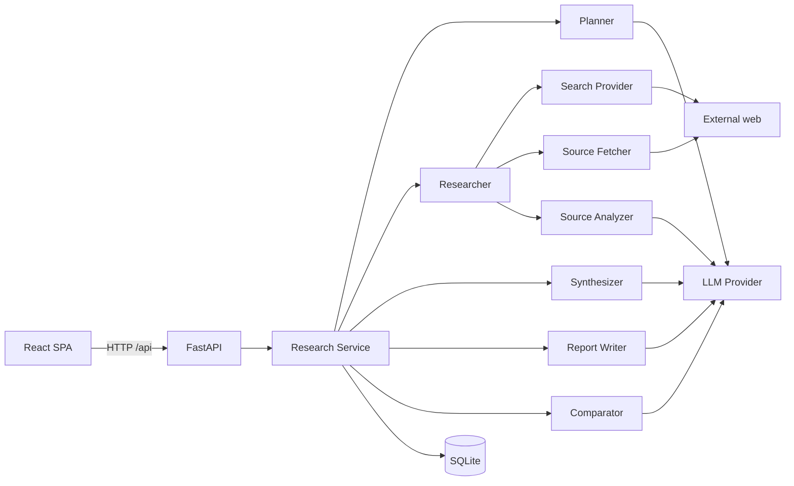

# REACH — Architecture

> Research Exploration, Aggregation & Context Hub

REACH turns a research objective into a focused research workspace. Search
engines return sources; REACH organizes the investigation around the
objective.

Companion docs: [workflow.md](workflow.md) · [agent.md](agent.md) ·
[api.md](api.md) · [data-model.md](data-model.md) · [PRD.md](PRD.md).

## System overview



## Repository layout

```
reach/
├── apps/client/            React 19 + Vite + TypeScript + TanStack Query
├── server/             FastAPI + agents + SQLite
├── docs/                This documentation set
├── data/                SQLite database directory (gitignored contents)
├── scripts/             dev.sh · launch.sh
└── Makefile             setup / test / run / full / clean
```

## Layers (backend)

### API layer — `app/api/routes/research.py`

Endpoints under `/api/research…` (plus `GET /api/health` in `main.py`):

| Method | Path | Role |
| --- | --- | --- |
| `POST` | `/api/research` | Start session + async task → `session_id` |
| `GET` | `/api/research` | Session history summaries |
| `GET` | `/api/research/{id}/status` | Poll progress |
| `GET` | `/api/research/{id}` | Full workspace payload |
| `GET` | `/api/research/{id}/report` | Markdown report (`text/plain`) |
| `POST` | `/api/research/{id}/compare` | Pairwise comparison |
| `GET` | `/api/research/{id}/comparisons` | Comparison history |
| `GET` | `/api/research/{id}/workspace` | Filtered sources (`starred`/`saved`/`tag`) |
| `PATCH` | `/api/research/{id}/sources/{sid}` | Star/save/tag/note |
| `POST` | `/api/research/{id}/sources/{sid}/summarize` | On-demand analysis |

No WebSockets: progress is persisted to SQLite and the client polls.

### Research service — `app/services/research_service.py`

Orchestrator. Owns repositories, the in-flight task registry
(`MAX_CONCURRENT_RUNS = 16`), mock/real provider wiring, and stage
transitions:

```
PLANNING → SEARCHING → FILTERING → FETCHING → ANALYZING → SYNTHESIZING → REPORT → COMPLETE
```

(`REPORT` is a pipeline step; session status enum jumps from `synthesizing`
to `complete` after the report is written.)

Any uncaught failure marks the session `failed` with a human message
(truncated); partial state remains queryable.

### Research agent — `app/agent/`

See [agent.md](agent.md) for full behavior. Summary:

- **Planner** — 5–7 dimension-covering queries + academic guarantee + fallback.
- **Researcher** — concurrent search, dedupe/rank/select (8–15), bounded
  fetch/analyze under a semaphore.
- **Synthesizer** — findings with provenance ids, open questions, brief.
- **Comparator** — pairwise similarities / differences / contradictions.
- **Report writer** — intent-aware (`build`/`study`/`general`) markdown.

### Search layer — `app/search/`

- `SearchProvider` interface → `SearchResult`.
- `TavilySearchProvider` (default) and `MockSearchProvider`.
- URL normalization and dedupe utilities (tracking params stripped).

### Source processing — `app/sources/`

- **Classifier** — deterministic `SourceType` from domain/path/title.
- **Fetcher** — size/timeout/scheme bounds; session URL cache; mock transport.
- **Parser** — HTML → plain text; untrusted content never stored as HTML for UI.
- **Analyzer** — structured `SourceAnalysis` via LLM (+ fallback).

### LLM layer — `app/llm/`

- `generate` / `generate_structured` with JSON schema hint, extract, validate,
  bounded retry (`StructuredOutputError` on exhaustion).
- `OpenAICompatibleProvider` and `MockLLMProvider`.
- Prompts centralized in `prompts.py`.

### Models — `app/models/`

Typed Pydantic schemas for sessions, sources, findings/gaps/synthesis,
comparisons, and reports. See [data-model.md](data-model.md).

### Storage — `app/storage/`

SQLite via stdlib `sqlite3` (WAL, foreign keys, busy timeout). Tables:
`research_sessions`, `queries`, `sources`, `findings`, `finding_sources`,
`research_gaps`, `source_comparisons`. Incremental `_MIGRATIONS` for additive
columns. Focused repositories — no ORM.

## Data flow (per research run)

```
objective
  ↓ planner            queries (5–7)                        → queries
  ↓ search             normalized SearchResults
  ↓ dedupe/filter      candidate Sources
  ↓ rank/select        8–15 sources                         → sources
  ↓ fetch              bounded content (failures tolerated)
  ↓ analyze            SourceAnalysis                       → sources.analysis
  ↓ synthesize         findings + provenance                → findings / finding_sources
  ↓                    open questions                       → research_gaps
  ↓                    research brief                       → sessions.synthesis
  ↓ report             markdown                             → sessions.report
  ↓ complete
```

On-demand flows: `compare` → `source_comparisons`; workspace PATCH/GET/summarize
→ `sources`.

## Frontend — `apps/client/`

React 19 + Vite + TypeScript + TanStack Query.

| Route | Page | Role |
| --- | --- | --- |
| `/` | `Home` | Objective entry, progress, recent history |
| `/research/:id` | `ResearchSession` | Full results workspace |
| `*` | redirect | → `/` |

A normalization layer in `src/lib/api.ts` converts backend wire format into
typed view contracts so the UI is insulated from minor API shape drift.
`vite.config.ts` proxies `/api` → `localhost:8000` in development.

Key component groups: layout (`AppShell`, `TopBar`, `Sidebar`), research
(`ResearchInput`, `ResearchProgress`, `FindingCard`, `SourceCard`,
`SourceComparisonPanel`, `ResearchReportView`, `SessionHistoryList`), and
common states (`EmptyState`, `LoadingState`, `ErrorState`).

## Configuration

All settings use the `REACH_` prefix (`app/config.py` / `.env.example`):

| Area | Examples |
| --- | --- |
| LLM | `REACH_LLM_API_KEY`, `REACH_LLM_BASE_URL`, `REACH_LLM_MODEL` |
| Search | `REACH_SEARCH_API_KEY`, `REACH_SEARCH_PROVIDER`, result/query caps |
| Runtime | `REACH_MOCK_MODE`, `REACH_DATABASE_PATH` |
| Fetch | `REACH_FETCH_MAX_BYTES`, `REACH_FETCH_TIMEOUT_SECONDS` |
| CORS | `REACH_CORS_ORIGINS` |

## Design rules honored

- Bounded research: ≤7 queries, ≤15 sources, single fetch+analyze pass.
- Deterministic logic before LLM calls (classification, dedup, overlap).
- Typed structured output everywhere; free-form text never the source of truth.
- One failed source never kills a session.
- No provenance hiding: findings carry supporting source ids.
- Reports and comparisons degrade gracefully to deterministic fallbacks.
- No heavyweight infrastructure: no Redis/Celery/Kafka/vector DB.

## Security & trust boundaries (prototype)

| Boundary | Handling |
| --- | --- |
| Fetched web content | Parsed to text; not executed; not rendered as HTML |
| Secrets | Env-only `REACH_*`; never commit `.env` |
| AuthN/Z | Absent — assume trusted local operator |
| SSRF posture | http(s) scheme gate + timeouts + size caps (not a full SSRF mesh) |

## Future direction

Sessions are intentionally ephemeral. Later milestones can add cross-session
history, a knowledge graph from `finding_sources`, embeddings, and scheduled
re-runs without rewriting the pipeline core. See [PRD.md](PRD.md) and
[limitations.md](limitations.md).
