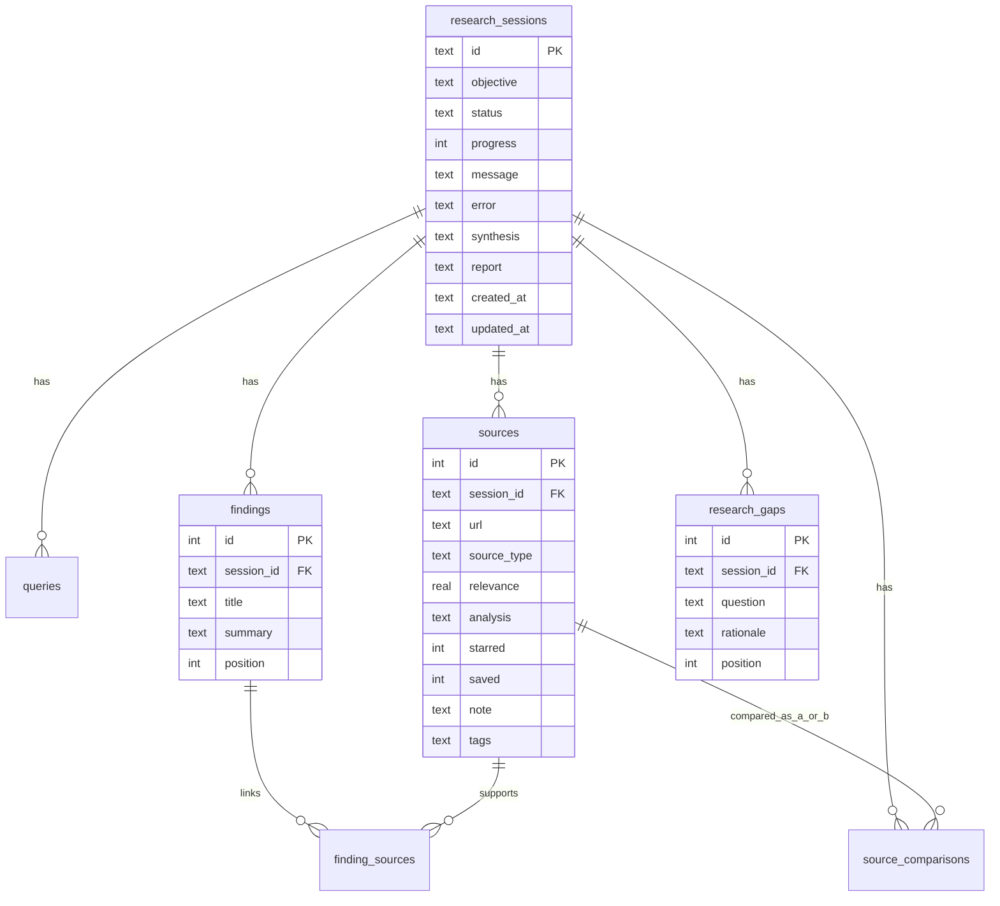

# REACH — Data model

Canonical domain and persistence model for REACH sessions, sources,
findings, gaps, comparisons, and reports. Pydantic models live under
`backend/app/models/`; SQLite DDL and migrations under
`backend/app/storage/database.py`.

Related: [api.md](api.md) · [architecture.md](architecture.md) · [agent.md](agent.md).

## 1. Entity-relationship overview

## 2. Enumerations

### SessionStatus

| Value | Meaning |
| --- | --- |
| `planning` | Generating queries |
| `searching` | Running search provider |
| `filtering` | Deduping / ranking / selecting |
| `fetching` | HTTP fetch of selected sources |
| `analyzing` | Per-source structured analysis |
| `synthesizing` | Cross-source brief + gaps (+ report after) |
| `complete` | Terminal success |
| `failed` | Terminal failure |

### SourceType

`paper` · `github` · `documentation` · `tool` · `project` · `article` · `other`

### SourceFetchStatus

`pending` · `fetched` · `partial` · `failed` · `skipped`

### ReportIntent

`build` · `study` · `general`

## 3. Domain models (Pydantic)

### Research session

| Model | Key fields |
| --- | --- |
| `StartResearchRequest` | `objective` (8–1000 chars, stripped) |
| `QueryPlan` | `queries: list[str]` |
| `ProgressUpdate` | `status`, `progress` 0–100, `message` |
| `ResearchSession` | `id`, `objective`, `status`, `progress`, `message`, `error`, timestamps |
| `ResearchSessionDetail` | Session + `queries`, `sources`, `findings`, `gaps`, `summary`, `comparisons`, `report` |
| `SessionSummary` | Lightweight history row + `sources_count`, `findings_count`, `gaps_count` |

### Source

| Model | Key fields |
| --- | --- |
| `SourceAnalysis` | `summary`, `key_points`, `technologies`, `concepts`, `why_relevant`, `limitations` |
| `Source` | identity/url/type/domain, `relevance` 0–1, `content`, `fetch_status`, `analysis`, workspace: `starred`, `saved`, `note`, `tags` |

Persistence helper `model_dump_stored()` JSON-encodes `analysis` and `tags`.

### Findings & synthesis

| Model | Key fields |
| --- | --- |
| `Finding` | `title`, `summary`, `supporting_source_ids` |
| `ResearchGap` | `question`, `rationale` |
| `ResearchSynthesis` | `overview`, `existing_projects`, `relevant_technologies` |
| `KeyFinding` | LLM-side finding with `source_titles` (mapped to ids) |
| `OpenQuestion` | LLM-side gap |
| `SynthesisResult` | Full structured synthesizer output |

### Comparison

| Model | Key fields |
| --- | --- |
| `ComparisonPoint` | `statement`, `source_a_evidence`, `source_b_evidence` |
| `SourceComparisonResult` | `overview`, similarities/differences/contradictions lists, `complementarity_notes` |
| `SourceComparison` | `source_a_id`, `source_b_id`, `result` |

### Report

| Model | Key fields |
| --- | --- |
| `ResearchReportContent` | Section fields (executive_summary, key_findings, …) |
| `ResearchReport` | `intent`, `markdown` |

## 4. SQLite schema

Database path default: `REACH_DATABASE_PATH=../data/reach.db` (resolved from
the backend package). Connection defaults: `foreign_keys=ON`,
`journal_mode=WAL`, `busy_timeout=5000`.

### `research_sessions`

| Column | Type | Notes |
| --- | --- | --- |
| `id` | TEXT PK | Opaque session id |
| `objective` | TEXT NOT NULL | User objective |
| `status` | TEXT NOT NULL | `SessionStatus` value |
| `progress` | INTEGER DEFAULT 0 | 0–100 |
| `message` | TEXT | Human progress text |
| `error` | TEXT | Failure detail (nullable) |
| `synthesis` | TEXT | JSON brief |
| `report` | TEXT | JSON `ResearchReport` (added via migration) |
| `created_at` / `updated_at` | TEXT | ISO timestamps |

### `queries`

| Column | Type | Notes |
| --- | --- | --- |
| `id` | INTEGER PK | Auto |
| `session_id` | TEXT FK CASCADE | |
| `query` | TEXT | Planned search string |
| `created_at` | TEXT | |

Index: `idx_queries_session`.

### `sources`

| Column | Type | Notes |
| --- | --- | --- |
| `id` | INTEGER PK | Auto |
| `session_id` | TEXT FK CASCADE | |
| `url` | TEXT | Canonical URL |
| `title` | TEXT | |
| `source_type` | TEXT | Enum string |
| `domain` | TEXT | |
| `description` / `snippet` | TEXT | |
| `relevance` | REAL | 0.0–1.0 |
| `content` | TEXT | Fetched plain text |
| `fetch_status` | TEXT | Enum string |
| `analysis` | TEXT | JSON `SourceAnalysis` |
| `starred` / `saved` | INTEGER | 0/1 workspace flags (migration) |
| `note` | TEXT | Free-text note (migration) |
| `tags` | TEXT | JSON string array (migration) |
| `created_at` | TEXT | |

Indexes: `idx_sources_session`, `idx_sources_url (session_id, url)`.

### `findings`

| Column | Type | Notes |
| --- | --- | --- |
| `id` | INTEGER PK | |
| `session_id` | TEXT FK CASCADE | |
| `title` | TEXT | |
| `summary` | TEXT | |
| `position` | INTEGER | Display order |

Index: `idx_findings_session`.

### `finding_sources` (provenance join)

| Column | Type | Notes |
| --- | --- | --- |
| `finding_id` | INTEGER FK CASCADE | |
| `source_id` | INTEGER FK CASCADE | |
| PK | (`finding_id`, `source_id`) | Many-to-many |

### `research_gaps`

| Column | Type | Notes |
| --- | --- | --- |
| `id` | INTEGER PK | |
| `session_id` | TEXT FK CASCADE | |
| `question` | TEXT | Open question |
| `rationale` | TEXT | Why it remains open |
| `position` | INTEGER | Display order |

Index: `idx_gaps_session`.

### `source_comparisons`

| Column | Type | Notes |
| --- | --- | --- |
| `id` | INTEGER PK | |
| `session_id` | TEXT FK CASCADE | |
| `source_a_id` / `source_b_id` | INTEGER FK CASCADE | Pair within session |
| `result` | TEXT | JSON `SourceComparisonResult` |
| `created_at` | TEXT | |

Index: `idx_comparisons_session`.

## 5. Migrations

Additive column migrations are registered in `_MIGRATIONS` and applied
idempotently via `PRAGMA table_info` checks on `init_db`:

| Table | Added columns |
| --- | --- |
| `research_sessions` | `report` |
| `sources` | `starred`, `saved`, `note`, `tags` |

Fresh databases create the full `SCHEMA` script (including those columns);
older files pick up missing columns on startup.

## 6. Repositories

Focused classes in `app/storage/repositories.py` (short-lived connections):

| Repository | Responsibility |
| --- | --- |
| `SessionRepository` | CRUD session, progress, synthesis, report, list summaries |
| `SourceRepository` | Insert/update sources, workspace flags, tag filter |
| `FindingRepository` | Findings, gaps, provenance joins |
| `ComparisonRepository` | Persist/list pairwise comparisons |

No generic repository base class and no ORM layer by design.

## 7. Frontend view contracts

`apps/web/src/types/research.ts` and `types/source.ts` mirror backend concepts
with UI-friendly naming. `lib/api.ts` normalizes:

| Backend | Frontend view |
| --- | --- |
| `relevance` 0–1 | 0–100 score |
| `source_type` | `type` |
| `fetch_status: fetched` | `success` |
| `fetch_status: skipped` | `pending` |
| gap `question` / `rationale` | `title` / `description` |

The UI must not persist alternate schemas; the backend remains the source of
truth.

## 8. Data lifecycle

| Phase | Data written |
| --- | --- |
| Start | `research_sessions` row |
| Plan | `queries` rows; status/progress |
| Select | `sources` rows (pre-fetch) |
| Fetch/analyze | `sources.content`, `fetch_status`, `analysis` |
| Synthesize | `findings`, `finding_sources`, `research_gaps`, `synthesis` |
| Report | `report` |
| Complete / fail | terminal `status` |
| Post-run | workspace columns; `source_comparisons`; refreshed `analysis` on summarize |

Cascade deletes: removing a session removes dependent queries, sources,
findings, gaps, and comparisons.

## 9. Retention & privacy (prototype)

- No user accounts; all sessions share one local database file.
- No automated TTL/GC in v0.1 — operators may delete `data/reach.db*`.
- Fetched source text may include third-party copyrighted material; store
  only what is needed for analysis and treat content as untrusted.
- Do not commit database files or `.env` secrets.

## 10. Extension guidance

When adding entities:

1. Add Pydantic models + validation.
2. Extend `SCHEMA` and, if needed, `_MIGRATIONS` for existing DBs.
3. Update repositories and API serializers.
4. Add storage + API tests.
5. Update this document and [api.md](api.md) in the same change.
