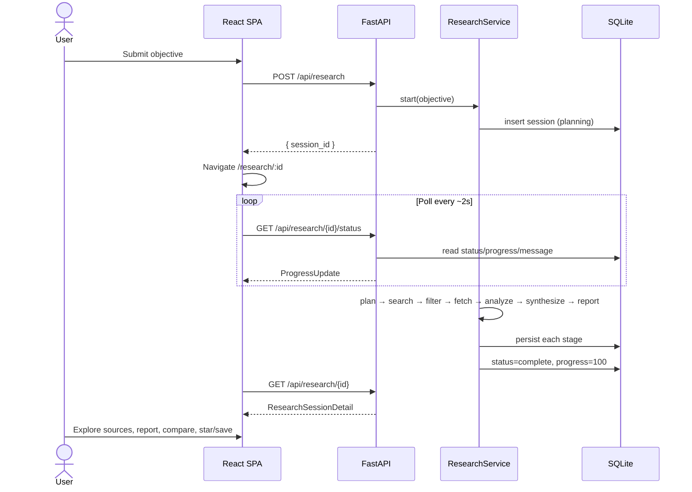

# REACH — Research & workspace workflow

This document describes the **user-visible** and **system** workflows for a
research session, from objective submission through workspace curation.
Implementation detail for agents lives in [agent.md](agent.md); HTTP shapes
in [api.md](api.md).

## 1. Happy path (research run)



### Stage timeline (persisted status)

| Stage | Typical progress | User-facing message (service) |
| --- | --- | --- |
| `planning` | 5% | Understanding objective and generating research queries |
| `searching` | 20% | Discovering relevant sources across the web |
| `filtering` | 40% | Filtering and ranking candidate sources |
| `fetching` | 60% | Fetching selected sources |
| `analyzing` | 82% | Analyzing source content |
| `synthesizing` | 95% | Building the research brief and open questions |
| `complete` | 100% | Research finished |
| `failed` | (last) | Error message truncated ≤200 chars |

Report generation runs after synthesis and before `complete`; it does not
introduce a separate `SessionStatus` value.

## 2. Pipeline workflow (system)

```
objective
  │
  ▼
┌─────────────┐
│   Planner   │  LLM structured QueryPlan (5–7 queries) + academic guarantee
└──────┬──────┘
       ▼
┌─────────────┐
│  Researcher │  concurrent search per query
│  · search   │  normalize → dedupe
│  · select   │  rank → keep 8–15 (relevance ≥ 0.25)
│  · fetch    │  bounded httpx (failures → partial/failed, isolated)
│  · analyze  │  SourceAnalysis per source (semaphore)
└──────┬──────┘
       ▼
┌─────────────┐
│ Synthesizer │  findings + gaps + ResearchSynthesis (+ provenance ids)
└──────┬──────┘
       ▼
┌─────────────┐
│Report writer│  intent detect → ResearchReportContent → markdown
└──────┬──────┘
       ▼
   complete → SQLite workspace payload ready
```

Persistence checkpoints occur between major stages so an interrupted or
failed run still exposes partial queries/sources when available.

## 3. Post-run workflows

### 3.1 Read the workspace

1. Client loads `GET /api/research/{id}` once status is terminal (`complete`
   or, for inspection, `failed` with partial data).
2. UI normalizes wire fields (`source_type` → `type`, relevance 0–1 → 0–100,
   gap `question`/`rationale` → `title`/`description`).
3. User reviews summary, findings (with evidence links), ranked sources,
   gaps, and markdown report.

### 3.2 Pairwise comparison

```
User selects source A + source B
  → POST /api/research/{id}/compare { source_a_id, source_b_id }
  → Comparator (LLM structured SourceComparisonResult, fallback on failure)
  → persist source_comparisons
  → UI renders similarities / differences / contradictions
```

History: `GET /api/research/{id}/comparisons`.

### 3.3 Workspace curation

| Action | API | Effect |
| --- | --- | --- |
| Star / unstar | `PATCH .../sources/{sid}` `{ "starred": true }` | Flag for quick filter |
| Save / unsave | `PATCH` `{ "saved": true }` | Flag for library-style filter |
| Tags | `PATCH` `{ "tags": ["indexing","rust"] }` | JSON array on source |
| Note | `PATCH` `{ "note": "..." }` | Free-text annotation |
| List curated | `GET .../workspace?starred=&saved=&tag=` | Filtered source list |
| Summarize | `POST .../sources/{sid}/summarize` | Fresh `SourceAnalysis` |

### 3.4 Session history

1. Home loads `GET /api/research?limit=8` (newest first).
2. Each row shows objective snippet, status, and counts
   (`sources_count`, `findings_count`, `gaps_count`).
3. Click navigates to `/research/:id` (rehydrates full detail).

Optional filters: `status`, `exclude_in_progress`, `limit` (1–200).

## 4. Failure & degradation workflows

| Failure | System behavior | User experience |
| --- | --- | --- |
| Objective too short / blank | 422 validation | Inline / HTTP error; no session |
| Concurrent run cap exceeded | 429 | Message that capacity is full |
| Planner LLM fails | Deterministic 3-query fallback | Run continues |
| One search query fails | Query skipped; others proceed | Possibly fewer candidates |
| Source fetch fails | `fetch_status=failed/partial`; no analysis or limitation note | Source card shows retrieval state |
| Analyzer LLM fails | Per-source fallback analysis | Thin analysis, session continues |
| Synthesizer fails | One finding per source + generic gap | Session still completes |
| Report LLM fails | Deterministic markdown sections | Report still available |
| Uncaught pipeline error | `status=failed` + truncated error | Progress shows failed; partial data may remain |

## 5. Mock-mode workflow

When `REACH_MOCK_MODE=mock`:

1. Mock LLM returns schema-shaped deterministic objects (no network).
2. Mock search returns template URLs (GitHub, arXiv, docs, etc.).
3. Mock fetch transport returns tiny HTML pages.
4. Pipeline, API, UI, and `scripts/launch.sh` smoke test exercise the full
   contract without keys.

Use mock mode for CI, demos, and frontend development. Real research
requires LLM + search keys with `REACH_MOCK_MODE=off`.

## 6. Developer verification workflow

```bash
make setup          # once
make test           # hermetic backend + web checks
./scripts/launch.sh # boot mock backend (+ optional web) and smoke API contract
```

Manual curl path is documented in [development.md](development.md).

## 7. Frontend navigation map

| Step | Route / UI | Trigger |
| --- | --- | --- |
| Enter objective | `/` Home · `ResearchInput` | Submit |
| Watch progress | Home / session · `ResearchProgress` | Poll status |
| Explore results | `/research/:id` | Status `complete` |
| Compare sources | `SourceComparisonPanel` | Compare action |
| Curate | `SourceCard` actions | Star/save/tag/note/summarize |
| Revisit | Home · `SessionHistoryList` | Click prior session |

## 8. Concurrency model

- Each `POST /api/research` schedules an in-process `asyncio` task.
- Active runs are tracked; more than **16** concurrent starts are rejected.
- Fetches/analyses inside a run share a semaphore (default concurrency **5**).
- Progress is always read from SQLite — clients never depend on in-memory
  task state alone.

## 9. Related documents

- [agent.md](agent.md) — agent responsibilities and ranking formula  
- [api.md](api.md) — request/response contracts  
- [data-model.md](data-model.md) — persisted entities  
- [architecture.md](architecture.md) — layering and design rules  
